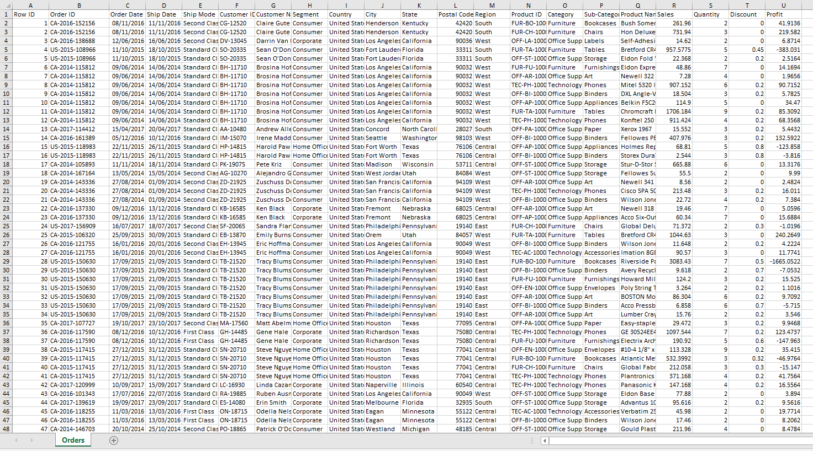

[← Back to Main Analytics Portfolio](https://github.com/blakusnaku/blakusnaku-analytics-portfolio)
# 🏪 Superstore Data Cleaning Workflow

A structured Excel-based data cleaning and preprocessing project on the Superstore dataset, preparing it for analysis and dashboarding.

---

## 🖼️ Preview



> **Before vs After:** Handled missing values, normalized categories, removed duplicates and outliers.

---

## Project Files

```
blakusnaku-superstore-cleaning/
│
├── data_raw/
│   ├── superstore_raw.xls              # raw dataset
│
├── data/
│   ├── superstore_cleaned_v1.xls       # after cleaning only
│   ├── superstore_cleaned_v2.xls       # after cleaning + pivots
│   ├── superstore_clean_extract_v1.xls # applying clean_status flag
│
├── dashboards/
│   ├── superstore_dashboard.xlsx       # final output for superstore
│   ├── week1_summary.md                # learning reflection for week 1
│
├── docs/
│   ├── data_documentation.xls          # structured audit log
│   ├── data_documentation.md           # narrative log
│ 
├── assets/
│   ├── sales_by_category.xls           # pivot: sales by category
│   ├── top10_products_report.pdf       # one-page PDF report: top 10 products by sales
│   ├── sales_dashboard_2014_2017.xlsx  # consolidated dashboard (charts + pivots)
│   ├── screenshots/
│       ├── sales_by_category.png
│       ├── pivot_cat_subcat.png
│       ├── data_raw.png
│       ├── data_cleaned.png

```

---

## 🧽 Cleaning Steps & Key Decisions
- **Null handling:** Imputed or cleaned missing values in `PostalCode`, `State`, `City`  
- **Duplicate removal:** Eliminated exact duplicate rows  
- **Standardization:** Unified category names, trimmed whitespace  
- **Outlier filtering:** Removed extreme values in `Sales`, `Profit` columns beyond 3σ  
- **Validation checks:** Cross-checks on region vs state consistency  

These steps result in a dataset that’s ready for meaningful analysis and dashboarding.

---

## 🛠 Tools & Skills
- Microsoft Excel  
- Data profiling (counts, distinct checks)  
- Named ranges and structured references  
- Version control via GitHub

---

## 🔗 Related Repositories
| Project | Focus | Link |
|--------|--------|------|
| 🛳️ Titanic Dashboard | Dashboard and analysis | [Titanic Repo →](https://github.com/blakusnaku/blakusnaku-titanic-dashboard) |
| 📁 Portfolio | Main analytics portfolio gallery | [Portfolio →](https://github.com/blakusnaku/blakusnaku-analytics-portfolio) |

---

## 🪄 Future Enhancements
- Automate cleaning logic using Python (pandas)  
- Add a summary dashboard (e.g. cleaned vs raw metrics)  
- Version control of cleaned data (v1, v2…)  

---

## 🖋️ Credits & License
All work by **JP Malit (@blakusnaku)**  
*Original data: Superstore dataset (public domain)*  

© 2025 JP Malit — All rights reserved  
[← Back to Main Analytics Portfolio](https://github.com/blakusnaku/blakusnaku-analytics-portfolio)
